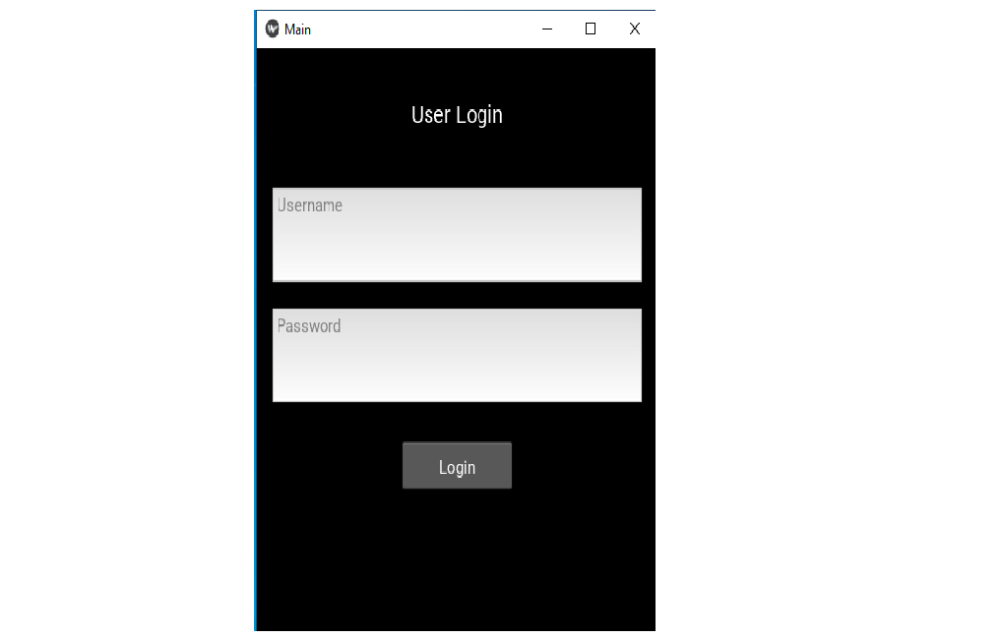

<h1>Feel-Good Mobile App Python</h1>

<strong>Feel-Good mobile app is made from python programming language,kivy libraries and 
JSON file as database. This app is use to provide quotes when person type he/she is 
happy,sad,excited and other feelings by accepting user input it suggest the quote
from which your would be started. More or less every people in his/her normal life
always need some type of suggestions hence this app might show light in path.</strong>

<h2>User Login Screenshot</h2>

<h2>Sign-Up Screenshot</h2>

<h2>Enlighten Me Screenshot</h2>

